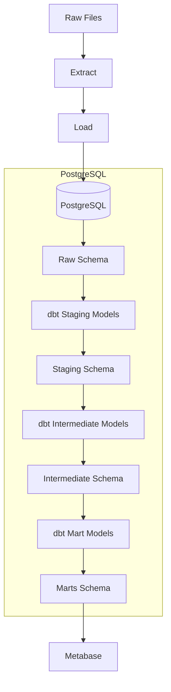
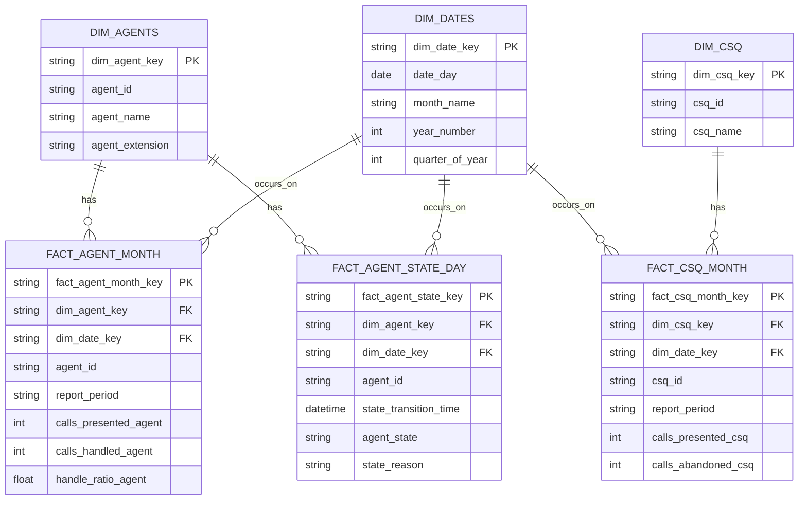
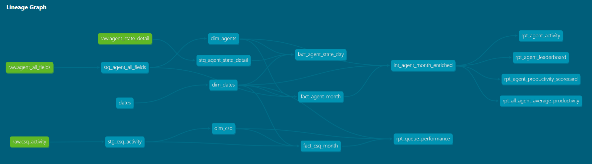
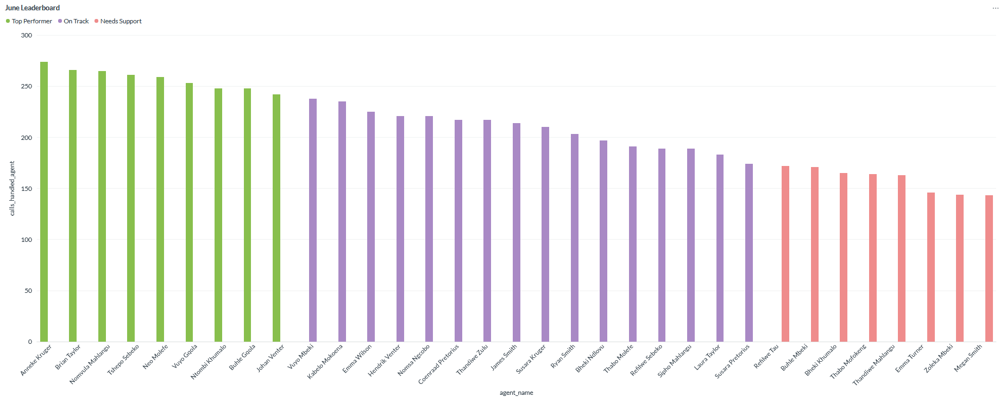
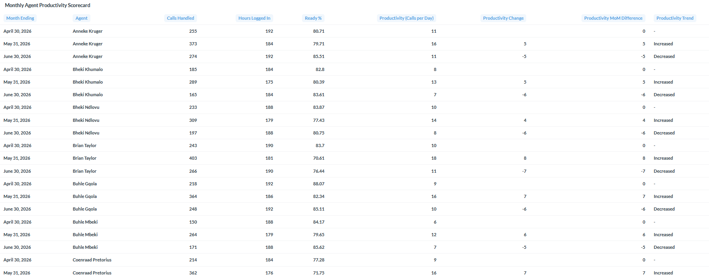
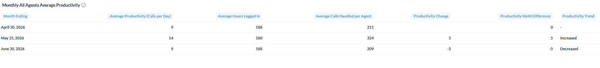
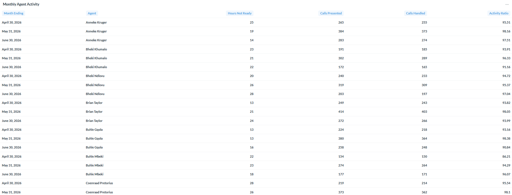
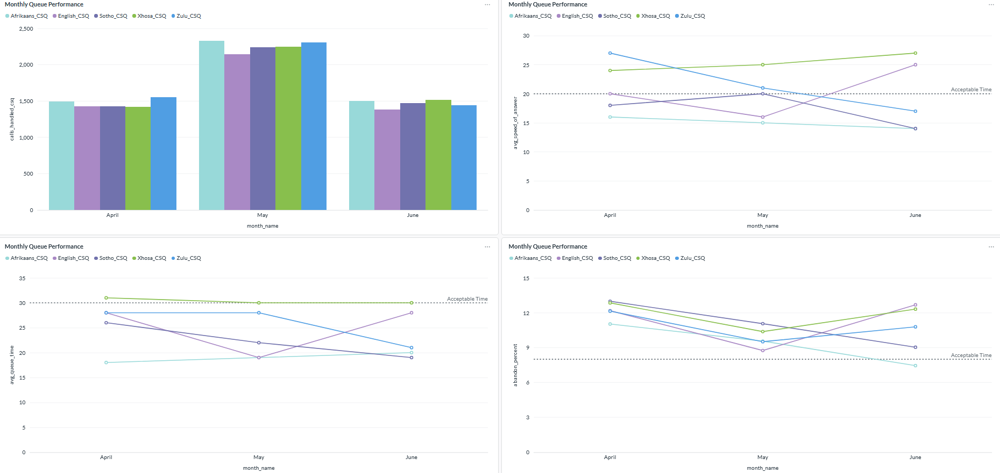
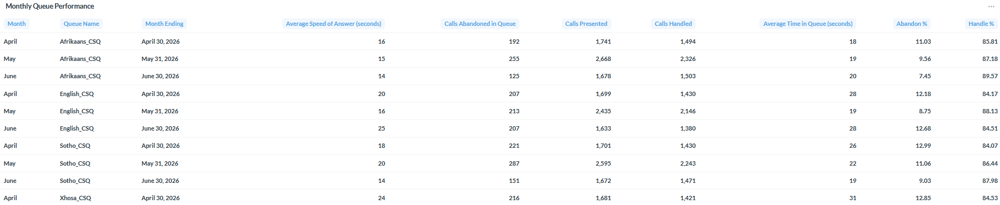

# ELT UCCX Monthly Reporting Pipeline

## Table of Contents

- [ 1 - Project Overview](#1---project-overview)
- [ 2 - Architecture](#2---architecture)
- [ 3 - Tools and Technologies](#3---tools-and-technologies)
- [ 4 - Repository Structure](#4---repository-structure)
- [ 5 - Data Model](#5---data-model)
- [ 6 - ELT Data Pipeline Walkthrough](#6---elt-data-pipeline-walkthrough)
  - [6.1 Setup the Environment](#61-setup-the-environment)
  - [6.2 Extract and Load](#62-extract-and-load)
  - [6.3 Transformation](#63-transformation)
  - [6.4 dbt Documentation](#64-dbt-documentation)
  - [6.5 Visualize the Data](#65-visualize-the-data)
- [ 7 - Documentation](#7---documentation)

 
## 1 - Project Overview

This project is a Monthly UCCX inbound call center reporting pipeline that turns exported CSVs into governed dashboards.

It builds an end-to-end ELT Data Pipeline, using Python for ingestion, DBT with SQL for transformations and business logic, and Metabase for visualizing the data in the form of dashboards.

PostgreSQL plays the central role - dbt Core provides version-controlled SQL transformations, testing, lineage, and documentation; Metabase provides a lightweight self-hosted dashboard layer that connects directly to the marts schema.

## 2 - Architecture



## 3 - Tools and Technologies
| Technology |Why it is Used|
----------------|----|
| Python| Data Ingestion|
| SQL| Transformations & Analytical Queries|
| DBT| Data modeling technique providing the Transformations Framework, Dependencies Management, Data Tests, Documentation|                          
| PostgreSQL| Relational Storage & SQL Execution|
| Metabase| Dashboards|


## 4 - Repository Structure

```
uccx-project-v2
├── README.md
├── data/	
│	 ├── agent_all_fields.csv
│	 ├── agent_state_detail.csv
│	 └── csq_activity.csv
├── .env.example
├── .gitignore
├── ingestion/
│    ├── uccx_extract_load.py
├── transform/
│	 ├── models/
│	 │	  ├── staging/
│    │    │	  ├── __sources.yml
│    │    │	  ├── _staging__models.yml
│    │    │	  ├── stg_agent_all_fields.sql
│    │    │	  ├── stg_agent_state_detail.sql
│    │    │   └── stg_csq_activity.sql
│	 │	  ├── intermediate/
│    │    │	  ├── _intermediate__models.yml
│    │    │	  ├── int_agent_month_enriched.sql
│    │    └── marts/
│	 │	  		├── core/
│    │        	│	├── _core__models.yml
│    │    	  	│	├── fact_agent_month.sql
│    │    	  	│	├── fact_agent_state_day.sql
│    │    	  	│	├── fact_csq_month.sql
│    │    	  	│	├── dim_agents.sql
│    │    	  	│	├── dim_csq.sql
│    │        	│	├── dates.sql
│    │    	  	│	├── dim_dates.sql
│	 │	  		└── reporting/
│    │        		├── _reporting__models.yml
│    │    	  		├── rpt_agent_activity.sql
│    │    	  		├── rpt_agent_leaderboard.sql
│    │    	  		├── rpt_agent_productivity_scorecard.sql
│    │    	  		├── rpt_all_agent_average_productivity.sql
│    │    	  		└── rpt_queue_performance.sql
│	 ├── lineage/
│	 │	 ├── dag.png
│	 ├── dbt_project.yml  
│	 ├── packages.yml
├── serving/ 
│	├── reporting_dashboards.sql
│	└── screenshots/
├── docs
│	├── adr.md
│	├── roadmap.md
│   ├── security.md
└── requirements.txt
```
- README: ingest data, run dbt, then create dashboards.
- data: contains the raw csv files exported from UCCX.
- ingestion: contains the Python data ingestion script performing Extract & Load. Python loads the raw data onto a PostgreSQL Database.
- transform: this is the dbt folder containing the data modeling files for the project.

  The models subfolder has the following subdirectories:
  - staging: cleans the source data and standardizes data types
  - intermediate: contains join logic that is shared by some downstream models.
  - marts: produces business-facing datasets in the form of a multiple fact tables star schema. This is further split into core and reporting subfolders which contain the star schema and dashboard models respectively.

  Within each of the two subfolders in the models folder, the .sql files contain SQL statements that defines each table. The .yml files contain model configurations and some testing and documentation information. 
  
  'dbt_project.yml' contains content about the entire dbt project such as project name, directory locations, model materialization settings, and schema names; 'packages.yml' contains contents regarding dbt packages used in the dbt project - these are dbt_utils and dbt_date. The lineage subfolder contains a screenshot of the DAG created by dbt.
- serving: contains the dashboard screenshots. It also contains reporting_dashboards.sql; these are Metabase SQL query exports for each dashboard deployed in Metabase.
- docs: contains some documentation for the solution.


## 5 - Data Model


## 6 - ELT Data Pipeline Walkthrough
The data source for this implementation is csv files from Cisco UCCX Application. Typically, the csv files would be exported from UCCX and saved on local disk, to be used in the pipeline. In this project, the files are synthetic data files generated by AI from a list of UCCX 12.5 historic reporting fields and descriptions provided to it for each file.

The transformation is performed using DBT + SQL. Here, dbt provides the transformation framework functionality and PostgreSQL the storage + SQL execution functionality.

The dataset for analytical queries is being served to the BI Tool in the form of the star schema [ Data Model](#5---data-model).  

### 6.1 Setup the Environment
-------------------------

**6.1.1. Prerequisites**:
  - The supported versions for the tools used in this project are:
    - Python: 3.13.14
      - Python packages/libraries installed are below, with the exact versions pinned in requirements.txt.
        -  pandas
        -  SQLAlchemy
        -  psycopg2
        -  dotenv
        -  dbt-core
        -  dbt-postgres 
        -  pgcli
    - PostgreSQL: 18
    - dbt Core: 1.12.0
    - Metabase: v0.62.3.6; Java 21
  - Create the resources:
    - Create a Virtual Machine that will run the tools for the project. In this project, I have installed the tools on my local machine instead.
      - *PostgreSQL*: Connect to the virtual machine/local machine and install PostgreSQL 18. The Windows installer can be downloaded from the PostgreSQL website. When the installation has been completed, create a database named 'uccx'; the schemas for the project will be automatically created as part of the extract & load process via the python ingestion script for the Raw schema, and the transform process via dbt for the Staging, Intermediate, and Marts schemas. Note, PostgreSQL will be integrated with Metabase and dbt Core.
      - *Metabase*: Connect to the virtual machine/local machine and install Metabase. The chosen installation method is the Self-hosting Metabase option of running the JAR file. Before installing Metabase, install Java 21; to confirm your installed version, issue 'java -version'. The Metabase JAR files can be downloaded from the Metabase website. 
        - Create a new Metabase directory and move the JAR file to it.
        - Change into your Metabase directory and issue the command:
          ```
          java --add-opens java.base/java.nio=ALL-UNNAMED -jar metabase.jar
          ```
        - When the installation and initialization processes are complete, navigate to [Metabase Overview page](http://localhost:3000) on your local machine or VM to setup Metabase.
        - Integrate Metabase with the uccx database on PostgreSQL, and define the schema to be integrated with Metabase as the Marts schema, i.e 'uccxmodels_marts'.
        - Deploy the dashboards by creating a collection using the SQL Native Query scripts in the [report dashboards](serving/reporting_dashboards.sql) file. Take note of the comments above each dashboard code.
        - Create a group for the dashboards role, thereafter create user accounts for the relevant users and assign to this group.

**6.1.2. Security and Access Configuration**
- Metabase connects to PostgreSQL using a dedicated read-only role. The role is restricted to the uccxmodels_marts schema and cannot modify pipeline data. Refer to [Metabase Role](docs/security.md) for the SQL query used. On Metabase, dashboard access is managed in Admin > Permissions through the relevant collection's group permissions, granting users in that group view access to the reports relevant to their role.
- In the Ingestion step, the PostgreSQL connectivity details are implemented using an [env](.env.example) file. 
- In the dbt environment, the PostgreSQL connectivity details defined in the profiles.yml file are hidden using .dbt.

**6.1.3. Environment**:    
  - Connect to the virtual machine (or local machine) and create the development virtual environment and activate it.
    ```
    python -m venv pipeline-env
    pipeline-env\Scripts\activate
    ```
  - Using the requirements.txt file - install the required Python, DBT, and PostgreSQL packages/libraries/adapters. These are pandas, sqlalchemy, psycopg2, dotenv, pgcli, dbt-core, and dbt-postgres. When the installation has been completed, issuing pip freeze as below will generate the requirements.txt file - you can check the versions of your packages there.
    ```
    pip freeze > requirements.txt
    ```

### 6.2 Extract and Load
--------------------
Data required for the reporting dashboards is extracted and stored in a relational storage system. 

Python is used as the data ingestion tool to extract the raw data from the UCCX csv files and load it to PostgreSQL database. The Python script can be found [here](ingestion/uccx_extract_load.py)

To perform the extract and load, run the Python script, including the directory path for the raw files as an argument. Recall, you have to configure the env file with your PostgreSQL credentials.
```
cd ingestion
python uccx_extract_load.py D:\uccx-project-v2\data
```
Verify the tables have been created in PostgreSQL:
```
pgcli -h localhost -U postgres -d uccx -p 5432
```
When connected to PostgreSQL, issue "\c uccx" to connect to the uccx database and "\dn" to confirm the raw schema has been created accordingly. Issuing "\dt raw.*" will display the list of tables that have been created in the raw schema. In this case, we see agent_all_fields, agent_state_detail, and csq_activity.   

### 6.3 Transformation
------------------
Data is transformed into a structure that is easier to understand and faster to query.

You have already installed dbt Core and the dbt PostgreSQL Adapter.
In your work directory, create the DBT Project directory that will contain files used to define the new tables, selecting 1 for the database type. Issue Ctrl/c when prompted for database details as these will be configured later. dbt will create a dbt directory named transform.
```
cd ..
dbt init transform
```
In the dbt-created folder, you will find the dbt_project.yml file, which contains the configuration details for the transformation stage of this project. In the dbt_project file, add the schema and set the materialization to 'view' for staging and intermediate models; and 'table' for the marts model.

Create and configure the profiles.yml file with details of your database. Run a dbt debug to verify dbt connectivity to the PostgreSQL database.

The 'profiles.yml' also contains connectivity details to the database. Because this file contains credentials, a .dbt is created for it as soon as the profiles.yml file has been created and connectivity tested. The .dbt is a hidden file created by dbt in uccx_dbt. To create the hidden file, issue the below:

```
cd transform
mv profiles.yml ~/.dbt
dbt debug
```

Create packages.yml in the transform directory (at the same level as dbt_project.yml). In the file, we will add dbt_utils and dbt packages. Issue the below to install those packages.
```
dbt deps
```

Data Modeling will be implemented inside the database following the Medallion Architecture. There will be a Staging layer, Intermediate layer, and a Marts layer split into core and reporting.

- Staging: Minimal transformations performed in this zone are deduping, renaming columns, and standardizing data types. 
- Intermediate: Join logic shared by several agent-related downstream models
- Marts: Modeling the data into a dimensional model that will be served to the BI Tool (Metabase). 

The below dbt subcommands will be used in the transformation process using dbt to check test connectivity to the database, run the models, run the data tests, and generate then serve the documentation:
|dbt sub commands |Description|
|-----------------------------------------------|-------------|
|dbt debug| Check connectivity to PostgreSQL|
|dbt run| Runs all models in the models folder - will use the selector|
|dbt run -s stg_agent_all_fields| Run this staging model|
|dbt run -s stg_agent_state_detail| Run this staging model|
|dbt run -s stg_csq_activity| Run this staging model|
|dbt run -s dim_agents| Run this mart model|
|dbt run -s dim_csq| Run this mart model|
|dbt run -s dates| Run this mart model|
|dbt run -s dim_dates| Run this mart model|
|dbt run -s fact_agent_month| Run this mart model|
|dbt run -s fact_agent_state_day| Run this mart model|
|dbt run -s fact_csq_month| Run this mart model|
|dbt run -s int_agent_month_enriched| Run this intermediate model|
|dbt run -s rpt_agent_leaderboard| Run this mart model|
|dbt run -s rpt_agent_productivity_scorecard| Run this mart model|
|dbt run -s rpt_all_agent_average_productivity| Run this mart model|
|dbt run -s rpt_agent_activity| Run this mart model|
|dbt run -s rpt_queue_performance| Run this mart model|
|dbt test| Run dbt data tests. The schema tests not_null, unique, and relationships are included|
|dbt docs generate| Generate the dbt documentation|
|dbt docs serve| Serve the dbt documentation|


#### Build the Staging Models

The prepared models for Staging can be found here, and also includes the yaml files that contains the source information (__sources.yml) and one that contains  properties (such as column names, descriptions, data tests) for the staging schema (_staging__models.yml):
```
├── transform/
│	 ├── models/
│	 │	  ├── staging/
```
The dbt project is located in the transform/ directory.
To start running the staging models, navigate to the dbt folder path from the uccx-project-v2 home directory:
```
cd transform
```

dbt run is used with the selector and name of each model to create the model in the database. I did this so that if there are errors on particular models those could be fixed before attempting to run another model.

The output on the terminal will show the model was run successfully.

Use pgcli to connect to the database and confirm the staging schema(uccxmodels_staging) has been created on PostgreSQL for the models. The schema name is defined in the dbt_project yaml file, where a setting has been configured for that schema to be materialized as views.

Verify the schema has been created in PostgreSQL:
```
cd transform
pgcli -h localhost -U postgres -d uccx -p 5432
```

When connected to PostgreSQL, issue "\c uccx" to connect to the uccx database and "\dn" to confirm the staging schema has been created accordingly. 


#### Build the Marts Models

The prepared models for Marts can be found here and also includes the yaml files that contain the properties for the marts schemas (_core__models.yml and _reporting__models.yml):
```
├── transform/
│	 ├── models/
│	 │	  ├── marts/
```
The facts and dimensions tables for the star schema are in marts/core and the dashboard models in the marts/reporting subfolder. You will start building the marts/core models, then the intermediate model (instructions in below section named "Build the Intermediate Models"), thereafter the marts/reporting models. To start running the marts models, if not already there, navigate to transform folder from the uccx-project-v2 home directory:
```
cd transform
```

dbt run is used with the selector and name of each model to create the model in the database.

Use pgcli to connect to the database and confirm the marts schema (uccxmodels_marts) and tables have been created on PostgreSQL for all the models.


#### Build the Intermediate Models

The prepared model for Intermediate can be found in below path and also includes the yaml file that contains the properties for the intermediate schema (_intermediate__models.yml):
```
├── transform/
│	 ├── models/
│	 │	  ├── intermediate/
```
To start running the intermediate models, if not already there, navigate to transform folder from the uccx-project-v2 home directory:
```
cd transform
```

dbt run is used with the selector and name of each model to create the model in the database.

Use pgcli to connect to the database and confirm the intermediate schema (uccxmodels_intermediate) and has been created on PostgreSQL for all the models. 


**Note:** Unlike the typical staging → intermediate → marts build order, this project's intermediate model depends on the core marts (it enriches fact_agent_month with dim_agents/dim_dates for reuse across reporting models), so the actual build order here is staging → marts/core → intermediate → marts/reporting.


### 6.4 dbt Documentation

To generate and serve the documentation, issue the dbt relevant docs sub commands as listed in the previous table.
The dbt documentation site contains information about the project, including DAG of the project, tests added to columns, column data types, column constraints, source and compiled code of each model, etc. 

When defining the models on dbt, using source and ref jinja functions instead of hard coding the table names enable dbt to create lineage information included in the documentation. The lineage graphs for the facts tables depicting the DAGs is below:




### 6.5 Visualize the Data
-----------------------
The SQL scripts for the Metabase dashboards can be found here:
```
├── serving
    └── reporting_dashboards.sql
```
- **6.5.1 - June Leaderboard Dashboard**
  - **Question**: Who were the top performers in June, and which agents need support?
  - **Reports on**: Performance and Productivity
  - **Implementation highlights**: Agents are grouped into performance bands using NTILE, with conditional logic used to classify support needs.



- **6.5.2 Monthly Agent Productivity Scorecard Dashboard**
  - **Question**: How did each agent perform in the reported months, and how does their productivity (number of calls handled per shift) compare to the previous month - was there a change in their productivity trend?
  - **Reports on**: Performance and Productivity
  - **Implementation highlights**: To determine the productivity trend for the agents, a Month over Month difference is calculated using LAG, then the trend determined from the results using conditional logic.


- **6.5.3 Monthly All Agents Average Productivity Dashboard**
  - **Question**: What was the average productivity for the agents in the whole Call Center team and what is the productivity trend? What was the busiest month in the past 3 months?
  - **Reports on**: Performance and Productivity


- **6.5.4 Monthly Agent Activity Dashboard**
  - **Question**: How many hours did the agent spend idle (Not Ready status) per month? What was the activity ratio for each agent? The Activity Ratio is calculated by dividing Calls Handled by the sum of Calls Handled and Private Outbound calls.
  - **Reports on**: Monitoring


- **6.5.5 Monthly Queue Performance Dashboard**
  - **Question**: How did the Call Center perform in the reported months? What was the abandon rate, average speed of answer, and average wait time spent in the queue?
  - **Reports on**: Performance and Productivity 




## 7 - Documentation
- [Architecture Decision Record](docs/adr.md) — rationale for using PostgreSQL as the central data platform.
- [Project Roadmap](docs/roadmap.md) — planned improvements and potential future enhancements.
- [Security and Access](docs/security.md) — PostgreSQL configuration to grant read-only access to the Metabase role.


