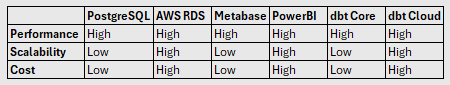

## Use PostgreSQL as the ELT warehouse.

## Context
- This is for architecture and build exploration.
- PostgreSQL is the central platform in the pipeline. Ingestion writes raw data to it, dbt transforms the data within it, and Metabase reads the curated marts for reporting.
- The batch architecture approach I chose is ELT (Extract Load Transform); real-time analysis is not critical, with data ingestion process and therefore the pipeline running only once a month.
- The dataset is very small since the datasource is in the form of csv files exported from the relational DB in UCCX.
- For transformation within PostgreSQL, I chose to organize the data in a Medallion architecture, with Staging, Intermediate, and Marts layers. The Marts layer is further split into Core and Reporting. Core contains the star schema models and Reporting contains the reporting BI-ready models. I staged the raw data before performing transformations to ensure the source of truth is always available to fall back on in the future if the business wants to make changes to the data they extract.
- The solution is designed to be loosely coupled and modular. This is important as, for example, say there is a requirement to move the solution to the cloud - modifying the system's storage and SQL execution component to replace the PostgreSQL database with AWS RDS would not change the Extract & Load process; The Virtual Machine hosting DBT Core and Metabase could also be rehosted on AWS EC2; both Metabase and DBT are supported on RDS.
- PostgreSQL was selected as the source DB as well as the target DB for DBT transformations. DBT integrates with PostgreSQL through an adapter, and the data transformed by DBT is visualized on Metabase, which integrates with the same PostgreSQL database on the Mart Schema. 
- I also chose the tools PostgreSQL, dbt Core, and Metabase as they are common components that can be used across the organisation. For example, using the same architecture, the pipeline might be modified to extract and serve data for a CUCM reporting pipeline use case, or for some Security use cases that have a relational database, etc. This would be beneficial for the organization as a whole.
- The use case is ingesting csv files downloaded from a UCCX Cluster deployed on premises and hosted on VMware. Spinning up a virtual machine on the same VMware infrastructure, for PostgreSQL and Metabase is simple and cost effective. The assumption here is that there will be available resources in that VMware environment for an additional VM. For this project, PostgreSQL, Metabase, dbt Core and Python environment are hosted and run on my local machine.
- The design ensures there is no requirement to purchase new hardware or licenses, the tools implemented are opensource (PostgreSQL, DBT, Metabase) and the location for the implementation is on premises rather than cloud or hybrid; data governance should not be too much of an issue. The design is optimized for cost and performance, given the dataset we are working on.
- The below tools were considered in the design decision:

    

    Given the dataset's small size and the monthly batch cadence, the lower scalability of PostgreSQL, Metabase, and dbt Core was an acceptable tradeoff for their significantly lower cost and minimal implementation effort. AWS RDS, PowerBI, and dbt Cloud offer stronger scalability, but that headroom isn't needed at this project's scale and would add licensing/subscription cost without a corresponding benefit here.

## Decision
The pipeline uses PostgreSQL as the warehouse.

## Consequences
### Benefits
- Low Cost - only engineering time is required as there is no subscription or license fees.
- High performance for the dataset for the purpose of the pipline.
- Minimal Implementation effort.
- Supported integration into chosen BI Tool (Metabase) and Transformation Tool (dbt Core).
- Security and Data Governance.

### Trade-offs
- Horizontal scalability is limited.
- The single-database implementation poses an availability risk.

## Status
Accepted.